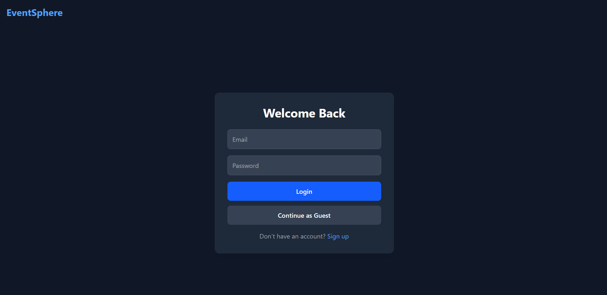
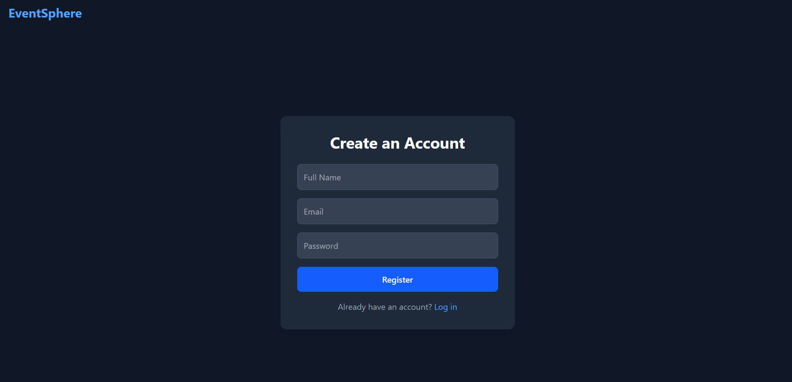
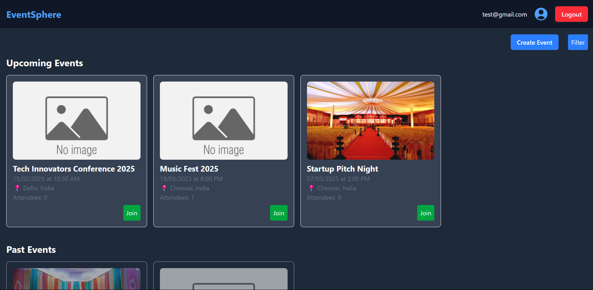

# Event Sphere

## Description
Event Sphere is an Event Management Application (SPA) designed to demonstrate full-stack development skills. It includes login functionality, a filter feature to filter events by date,time and categories, and a display of upcoming and past events. The application is built with React.js for the frontend, a backend API using Node.js (Express), and a MongoDB database for storing event data.

---


## Features  
### Frontend  
- **User Authentication:**  
  Users can register and log in securely. A "Guest Login" option is available to access limited features without registration.  
- **Event Dashboard:**  
  Displays a list of upcoming and past events with options to filter by categories and dates.  
- **Event Creation:**  
  Users can create events with fields like event name, description, date, time, and category.  
- **Real-Time Attendee List:**  
  Shows the number of attendees for each event in real-time, ensuring up-to-date information.  
- **Responsive Design:**  
  The platform works seamlessly across all devices, providing a consistent user experience.  

### Backend  
- **Authentication API:**  
  Utilizes **JWT (JSON Web Tokens)** for secure user authentication and session management.  
- **Event Management API:**  
  Supports full **CRUD (Create, Read, Update, Delete)** operations for event management with ownership restrictions to ensure users can only modify their own events.  
- **Real-Time Updates:**  
  Implements **WebSockets** for real-time updates on the attendee list and event changes.  
- **Database:**  
  Uses **MongoDB** for efficient storage and retrieval of user and event data.  

## Tech Stack  
- **Frontend:** React.js, Tailwind CSS, Redux
- **Backend:** Node.js (Express)  
- **Database:** MongoDB  
- **Authentication:** JWT  
- **Real-Time Communication:** Socket.io  


## Installation and Setup  

### Prerequisites
- **Node.js**: Install from [Node.js official website](https://nodejs.org/en/download)
- **Git**: Ensure Git is installed on your system.

1. Clone the repository:  
   ```bash  
   git clone https://github.com/yourusername/event-sphere.git 

2. Navigate to the project directory
    ```bash  
    cd event-sphere 

3. Install dependencies for both frontend and backend
    ```bash  
    cd frontend  
    npm install  
    cd ../backend  
    npm install 

4. Configure environment variables in a .env file for the backend

  Backend (/backend/.env):
    ```bash  
    MONGO_URI=<your_mongo_uri>
    JWT_SECRET=<your_jwt_secret>
    JWT_EXPIRES_IN=7d
    PORT=5000

  Frontend (/frontend/.env):
    ```bash  
    VITE_API_URL=http://localhost:5000

5. Start the development server
    ```bash  
    cd backend  
    npm start  

6. In a separate terminal, start the frontend
    ```bash  
    cd frontend  
    npm run dev  


## Usage
1. Register or Log In to access the full feature set.
2. Explore Events: Filter events by category or date to find what interests you.
3. Create Events: Add your own events with detailed information like date, time, and description.
4. Real-Time Updates:  See attendee lists and event changes in real-time using WebSockets.

Below are screenshots of key application pages:

  - 
  - 
  - 